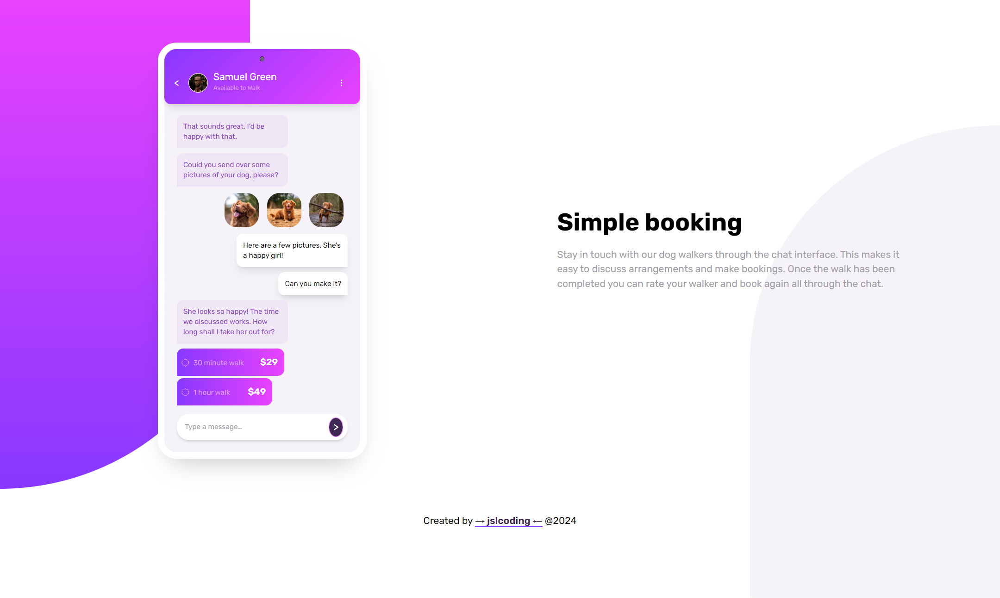

# Frontend Mentor - Chat app CSS illustration solution

This is a solution to the [Chat app CSS illustration challenge on Frontend Mentor](https://www.frontendmentor.io/challenges/chat-app-css-illustration-O5auMkFqY). 

## Table of contents

- [Overview](#overview)
  - [The challenge](#the-challenge)
  - [Screenshot](#screenshot)
  - [Links](#links)
  - [Built with](#built-with)
- [Author](#author)

## Overview

### The challenge
Users should be able to:
- View the optimal layout for the component depending on their device's screen size

### Screenshot

### Links
- Solution URL: [https://github.com/jslcoding/booking_chat_promo](https://github.com/jslcoding/booking_chat_promo)
- Live Site URL: [https://jslcoding.github.io/booking_chat_promo/](https://jslcoding.github.io/booking_chat_promo/)

### Built with
- Semantic HTML5 markup
- CSS custom properties
- Flexbox
- TailwindCSS

### Author
@jslcoding - jessica sanmartin limes
